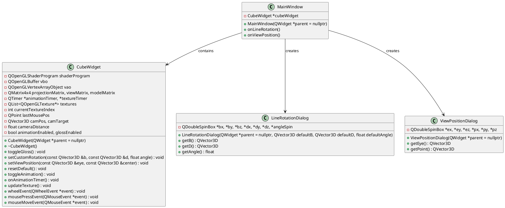

# Project Documentation: Cube Rotation Visualization (Part A) 📚

## Overview 👀

This project is a Qt-based OpenGL application that renders a 3D cube with an animated magma texture. It provides a menu-driven interface to interact with the cube via several features:

1. **Line Rotation** ✏️  
   - **What it does**: Lets the user specify a line defined by a point **b** and a direction vector **d** along with a rotation angle (α).  
   - **How it's implemented**:  
     - A dialog (LineRotationDialog) collects the parameters.
     - The cube is rotated using the transformation:  
       `M = T(+b) * R(α, normalized(d)) * T(-b) * M_current`
     - The dialog is pre-populated with default values based on the current state.

2. **View Position** 👁️  
   - **What it does**: Allows the user to change the camera position (eye) and the point the camera is looking at.  
   - **How it's implemented**:  
     - A dialog (ViewPositionDialog) collects the eye and target coordinates.
     - The view matrix is updated using a `lookAt` transformation.

3. **Default Position** 🔄  
   - **What it does**: Resets the view to its default state (camera at (0,0,3) looking at the origin).  
   - **How it's implemented**:  
     - The `resetDefault()` method sets the view matrix and resets the model matrix.

4. **Animation** ⏩  
   - **What it does**: Toggles an automatic rotation of the cube around the Y-axis.  
   - **How it's implemented**:  
     - A QTimer triggers continuous rotation updates.

5. **Texture Animation** 🔥  
   - **What it does**: Cycles through three phases of the magma texture every 700ms.  
   - **How it's implemented**:  
     - The 16×48 texture is split into three 16×16 sub-images.
     - A timer cycles through these textures.

6. **Gloss Effect Toggle** ✨  
   - **What it does**: Applies a gloss (specular highlight) effect on bright areas of the texture.  
   - **How it's implemented**:  
     - The fragment shader uses a `smoothstep` between brightness thresholds (values corresponding to colors #CA4E06 and #F89E44) to compute a specular component.
     - A toggle in the menu enables/disables the effect via a uniform (`uGlossOn`).

7. **Zoom & Manual Rotation** 🔍🖱️  
   - **What it does**:  
     - **Zoom**: The mouse wheel adjusts the camera distance.  
     - **Manual Rotation**: Clicking and dragging rotates the cube manually (disabling automatic animation).
   - **How it's implemented**:  
     - The `wheelEvent()` updates the view matrix.
     - Mouse events compute rotation deltas to update the model matrix.

8. **Window Icon & Background** 🎨  
   - **What it does**: Sets a custom window icon and background color (#456990).  
   - **How it's implemented**:  
     - The MainWindow uses `setWindowIcon(QIcon(":/textures/textures/mine.png"));`.
     - In `initializeGL()`, `glClearColor(0.27f, 0.41f, 0.56f, 1.0f);` is called to set the background.

## Architecture and Implementation Details 🛠️

- **Project Structure**:  
  - The application is built using Qt Widgets and QOpenGLWidget.
  - All texture and icon files are managed using the Qt resource system (.qrc).

- **Rendering Pipeline**:  
  - **Vertex Data**:  
    Each vertex includes 8 floats: position (vec3), normal (vec3), and texture coordinates (vec2).  
  - **Shaders**:  
    Custom GLSL shaders implement Phong lighting (ambient, diffuse, specular) and a configurable gloss effect.
  - **Uniforms**:  
    Various uniforms control transformations, lighting parameters, and the gloss toggle.

## Visual Architecture Diagram 📊

Below is a sample PlantUML diagram representing the project structure:

